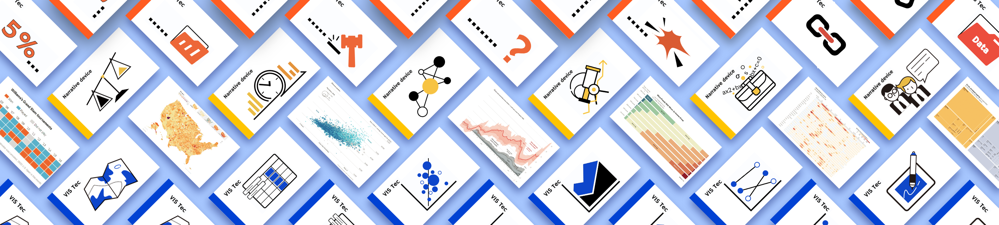

# Create Data-Driven News Articles

 

Through the analysis of 162 data-driven news articles collected from news media, we identified five types of articles based on the level of data involvement and narrative complexity: Quick Update, Briefing, Chart Description, Investigation, and In-depth Investigation. We then identified 72 [design patterns for data-driven news articles](https://datadrivenarticle.github.io/patterns.html) to support the design and creative exploration of data-driven articles. This work is published at CHI 2024, the paper can be found [here]().

## What are Data-Driven News Articles？

Data-driven journalism or data-driven news articles can be considered as journalism’s response to the datafication of society. They have been widely used in seasoned data news columns or personal blogs, also known as “textual narratives” and “magazine-style narrative visualizations”. The audience can easily delve into the database and explore personalized stories through fascinating visualization and interactions.

## Why design patterns？

There are many high-level guidelines on data-driven article design, including advice about data collection and cleaning, setting a story, and using visualizations and interactions. Apart from these, we know little about how to create different types of data-driven articles (e.g., a daily report or a survey), what are the essential components of data-driven news articles, and how to deal with these components.

Creating a compelling data-driven article is admittedly not straightforward, even experienced editors need to make an effort to deliberate titles, narrative structure, visual representations at their disposal, and necessary interactions. 
<!-- According to the existing production mode, it requires the editor to have various skills and experience to be equipped for the job. -->
Such a number of choices can be overwhelming, so there is a timely need for guidance in creating data-driven articles. 

### Data-driven news article creation patterns include: 
* Headline
* News Lead
* Data source
* Narrative
* Image
* Visualization title
* Visualization technique
* Visualization annotation
* Visualization caption
* Visualization Interaction
* and Viedo

If you have questions or suggestions, [get in touch](about.html).
