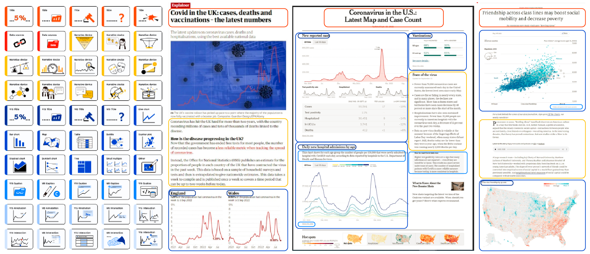

# Create data-driven article Workshop

This workshop aims to help you with the design of a data-driven article using a set of design patterns. The workshop will be held online and has synchronous and asynchronous parts. As part of our research, we aim to understand essential components and design principles for data-driven article design and how our design patterns can support this design process through ideation, reflection, and analysis.

# Goal

### What this workshop will help you with:
 * Learn about the different types of data-driven articles, their associations and differences.
 * Learn about the essential components of data-driven articles and their relationships.
 * Use design patterns and framework form to design an article, and perform type conversion by adding or subtracting.
 * Understand design decisions and tradeoffs.
 * Make deliberate design decisions and reflect on these choices.
 * Use state-of-the-art tools for mockups and design sketches (e.g., Figma, Miro).
 * Discuss your designs with peers and learn from others.

### What this workshop will not provide:
 * An introduction to Tableau, Power BI, or similar tools.
 * A workshop on programming visualizations, e.g., using d3.js or other libraries.
 * Do the actual writing for an article. Rather, we focus on structure and how visualization is used to support your argument

# Process
In this online workshop, we will introduce you to a set of data-driven article patterns to support creating data journals. As part of our research, we aim to evaluate a 5-level spectrum we identified from data journals ranging from quick data updates to in-depth analysis, and data journal patterns composed by essential elements in different modules (e.g., title, visualization, narrative). The workshop will last for 45-60 minutes with the following procedure:

  * **INTRODUCE：** We introduce you to the 5-level spectrum of use cases and design patterns we defined from data journals such as The Times, New York Times, The Guardian, The Economist, and BBC.
  * **ANALYSIS:** Pick one article of your choice, position it on the spectrum and introduce to us what patterns and elements are used, then transfer the structure of your article to another category on the spectrum by assembling the pattern cards.
  * **APPLICATION:** Imagine, using that same article as a base, and writing an article for another scenario on the spectrum.
  * **DISCUSSION:** An open discussion about your design decisions and tradeoffs you made during the transferring process, and your opinions towards using these patterns.
